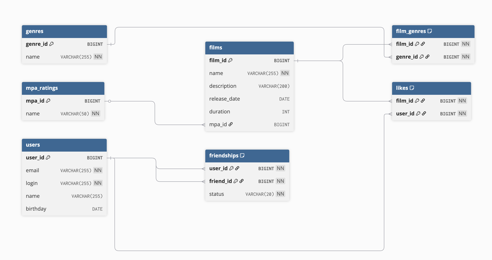

# Filmorate API

Filmorate is a RESTful web service for managing a collection of films and user data. It provides a simple API for
creating, retrieving, updating, and deleting films and users. The project is built with Java and the Spring Boot
framework, following a modular, domain-driven design approach.

## Project Structure

This project uses a multi-module Maven setup to enforce separation of concerns and improve maintainability. Each module
has a distinct responsibility:

* `common`: Contains shared code used across different modules, such as custom exceptions, validation utilities, and
  configuration properties.
* `films`: Implements all business logic related to films. This includes the domain model, application services,
  repository interfaces, and the web controller for the `/films` endpoint.
* `users`: Implements all business logic related to users. This includes the domain model, application services,
  repository interfaces, and the web controller for the `/users` endpoint.
* `friendships`: A module responsible for the friendship logic between users.
* `likes`: A module for managing film likes.
* `filmorate-app`: The main application module. It brings all the other modules together, contains the main application
  class (`FilmorateApplication`), and is responsible for building the final executable JAR file.

## Database Schema

Below is the database schema diagram, showing the tables and their relationships.

## Technologies

* **Java 21**
* **Spring Boot 3.x**
* **Apache Maven** for dependency management and build automation.
* **JUnit 5** & **AssertJ** for unit testing.
* **Lombok** to reduce boilerplate code.
* **H2 Database** as an in-memory database.

## Prerequisites

Before you begin, ensure you have the following installed on your system:

* **Java Development Kit (JDK)** version 21 or later.
* **Apache Maven**.

## How to Run the Project

### 1. Clone the Repository

git clone https://github.com/SergiusDu/java-filmorate.git
cd java-filmorate

### 2. Build the Project

Navigate to the root directory of the project and run the following Maven command. This will compile the code, run
tests, and package all modules.

mvn clean install

### 3. Run the Application

You can run the application using the `db` profile to work with the H2 database.

java -jar filmorate-app/target/filmorate-app-0.0.1-SNAPSHOT.jar --spring.profiles.active=db

The application will be available at `http://localhost:8080`.

## API Endpoints

The service exposes the following REST endpoints.

### Films

* `GET /films`: Retrieves a list of all films.
* `POST /films`: Adds a new film.
* `PUT /films`: Updates an existing film.
* `GET /films/{id}`: Retrieves a film by its ID.
* `PUT /films/{id}/like/{userId}`: Adds a like to a film.
* `DELETE /films/{id}/like/{userId}`: Removes a like from a film.
* `GET /films/popular`: Retrieves a list of the most popular films.

### Users

* `GET /users`: Retrieves a list of all users.
* `POST /users`: Adds a new user.
* `PUT /users`: Updates an existing user.
* `GET /users/{id}`: Retrieves a user by their ID.
* `PUT /users/{id}/friends/{friendId}`: Adds a user as a friend.
* `DELETE /users/{id}/friends/{friendId}`: Removes a user from friends.
* `GET /users/{id}/friends`: Retrieves a list of a user's friends.
* `GET /users/{id}/friends/common/{otherId}`: Retrieves a list of common friends with another user.

### Genres and MPA Ratings

* `GET /genres`: Retrieves a list of all genres.
* `GET /genres/{id}`: Retrieves a genre by its ID.
* `GET /mpa`: Retrieves a list of all MPA ratings.
* `GET /mpa/{id}`: Retrieves an MPA rating by its ID.